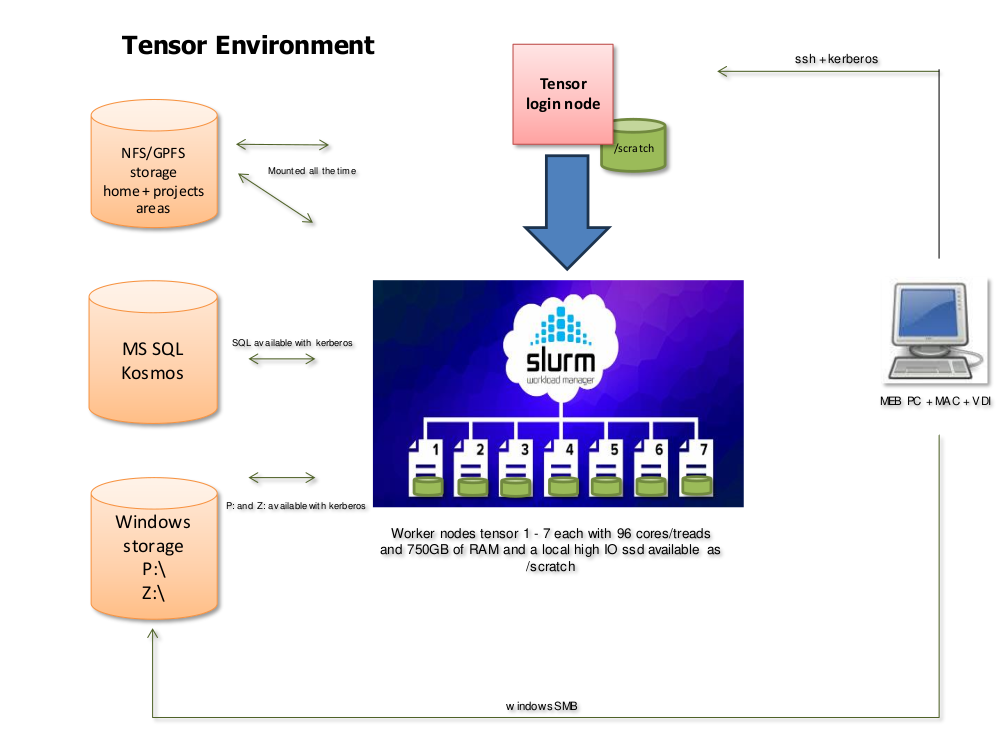
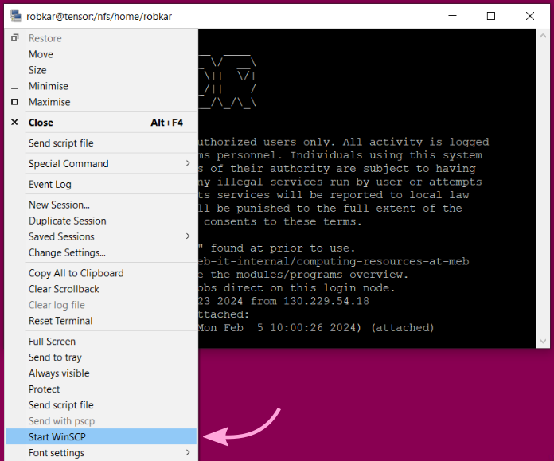

# User documentation for the tensor compute cluster at MEB

Robert Karlsson
2024-02-20

## What is tensor?

Tensor is a small High Performance Computing cluster available to MEB
researchers. It replaces previous compute servers `vector` and `scalar[1-4]`.

The tensor cluster consists of a login node (`tensor`) and seven compute nodes
(`tensor[1-7]`) with capable CPUs and fast local storage. A selection of
common software is preinstalled, and more can be added on request.

As on larger HPC systems, work is typically done by submitting jobs to a queue
system, where they will be processed in order.



## Connecting

The login node `tensor.meb.ki.se` or just `tensor` is only accessible from
within MEB's network (or through VDI).

### Windows

Use KiTTY, (available in MEB Software Center), or your own preferred SSH program
to connect to the host `tensor`.

> [!TIP] 
> Create a saved KiTTY session with the hostname `tensor`, and tick the
> box in `Connection -> Data` to "Use system username". With this setting you
> should be able to connect without typing anything (your Windows login will be
> re-used).

### Mac/Linux

Use `ssh` in the terminal, or some other interface that you prefer, to connect
to `tensor` with your MEB username and password.

> [!TIP]
> Use SSH keys for passwordless login (see for example [instructions at
> Uppmax](https://www.uppmax.uu.se/support/faq/login-problems-faq/how-do-i-use-ssh-keys-to-login-to-uppmax/))

## Software modules

Preinstalled software packages on tensor are available through the **modules**
(lmod) system. A quick introduction is available at the [lmod
website](https://lmod.readthedocs.io/en/latest/010_user.html).

To run preinstalled software you first need to load it with the `module load`
command (or the shorter but equivalent `ml`).

When more than one version of a package is available you can specify which one
to load or accept the default version which is usually the latest.

For example:

```bash
ml load R/4.3.2
ml load bcftools/1.19
ml load rclone
```

To always load a certain set of modules, [add them to your `.bashrc` startup
script](https://lmod.readthedocs.io/en/latest/010_user.html#controlling-modules-during-login).

To see the current list of available modules (including dependencies), type `ml
avail`. The following packages (+ dependencies) are installed as of 2024-02-19.

```
  # statistics
  - R 4.3.2
  - rstudio 2023.09.1
  
  # genetics
  - gtool 0.7.5
  - qctool 2.2.0
  - snptest 2.5.6
  - gcta 1.94.1
  - plink 1.07
  - plink 1.90b7.1
  - plink2 2.00a5.10
  - metal 2011-03-25
  - metal 2020-05-05
  - EIGENSOFT 8.0.0
  - bedtools 2.31.1
  - htslib 1.19.1
  - bcftools 1.19
  - samtools 1.19.2
  - ldsc 2.0.1
  - gtc2vcf 2023-12-06
  
  # general tools
  - ncdu 1.19
  - tmux 3.3a
  - rclone 1.65.2
  - parallel 20240122
  - nextflow 23.10.1
```

## Running jobs - Slurm

The login node `tensor` has very limited capacity (by design), and is only to be
used for job submission, monitoring, and other light tasks. Any serious
computation, *including interactive analyses*, should be done on the compute
nodes `tensor[1-7]` by submitting requests for resources to the Slurm job
queue. This is a change from the recommendations for the older vector/scalar servers.

The tensor cluster currently runs [Slurm version
23.11.1](https://slurm.schedmd.com/archive/slurm-23.11.1/).

### Batch jobs - `sbatch`

Run a batch job by preparing a shell script file with the commands you want to
run on the cluster, and then submit it with the command

```bash
sbatch my_job_script.sh
```

You can specify the CPU core, time, and memory requirements as options to sbatch
on the command line (`-c ...`, `-t ...`, `--mem=...` or `--mem-per-cpu=...`), OR
as special comments at the start your script file (before any actual commands):

```bash
#!/bin/bash

#SBATCH -c ...
#SBATCH -t ...
#SBATCH --mem=...

...

[the code you really want to run]
```

See [the Slurm
manual](https://slurm.schedmd.com/archive/slurm-23.11.1/sbatch.html) for how to
format the requirements.

If any job parameters are left unspecified, the defaults are 2 CPU threads, 8 GB
RAM per CPU, and 4 hours of run time. The requirements cannot be increased once
the job has started.

Note that in most cases it is not enough to ask Slurm for more CPUs to make your
program run faster - you must usually adapt your code to make use of the given
resources.

In some cases it can be as simple as adding a `--threads N` flag to some command
that already knows how to run in parallel. In other cases it can make more sense
to split the data somehow, and then submit many smaller single-threaded slurm
jobs that each work on a small part of it.

### Interactive jobs - `salloc`

Start an interactive session on a compute node with the `salloc` command.
Specify the CPU core, time, and memory requirements as options on the command
line (`-c ...`, `-t ...`, `--mem=...` or `--mem-per-cpu=...`).

If any job parameters are left unspecified, the defaults are 2 CPU threads, 8 GB
RAM per CPU, and 4 hours of run time. The requirements cannot be increased once
the job has started.

#### Interactive jobs with graphical display (X)

First start an X server on your local computer. On Windows this means
starting the programs Xming or VcXsrv. On a Mac, try XQuartz. On Linux, an X
server is usually already running, or you already know how to start one if not.

In KiTTY, tick the box "Enable X11 forwarding" under `Connection -> SSH -> X11`
before connecting. On Mac/Linux, add the `-Y ` flag to your `ssh` command, or
add "ForwardX11Trusted yes" to the settings for tensor in your local
`~/.ssh/config` file.

Next, request an interactive job on tensor as usual, but add the flag `--x11`.

```bash
salloc [other job parameters] --x11
```

Graphical output from the allocated compute node (like a plot window in R)
should now appear on your computer.

## Storage

### /nfs files

Files in `/nfs/[projectname]/`, `/nfs/projects/[projectname]/`, and
`/nfs/home/[username]/` are stored on fast network drives available from all
tensor nodes. Use these paths for long-term storage of data, code, and results.

### /scratch

For temporary files created during a single Slurm job, which are no longer
needed after the job is finished, use the very fast node-local storage in
`/scratch/tmp/`.

Note that this folder is uniquely created for each Slurm job
(so jobs cannot see /scratch files created in other jobs), and it is
automaticaly cleared after the job ends (along with `/tmp/`).

### P: and Z: files

The Windows `P:` and `Z:` volumes are available on tensor as `/cifs/P/` and
`/cifs/Z/$USER/`. To access them you must have a valid Kerberos ticket (see
"[Kerberos authentication](#kerberos-authentication)" for how to get one).

> [!NOTE]
> For jobs requiring stable and high-performance file access, we recommend the
> `/nfs` and `/scratch` file systems over `/cifs`.

### File transfer to and from tensor

For transferring files between your computer and tensor, you can use scp
(WinSCP) or sftp (FileZilla, lftp).

If you are connecting with KiTTY, there is a menu option to open WinSCP over the
same connection as your terminal:


[rclone](https://rclone.org/) is available as a software module (`ml load
rclone` )for syncing files in cloud storage to tensor.

## Accessing the kosmos SQL server

The `kosmos` SQL server is available from tensor with a valid Kerberos ticket
(see "[Kerberos authentication](#kerberos-authentication)" for how to get one).

## Kerberos authentication

To set up credentials for a job using the kosmos SQL server and/or the Windows
`P:` and `Z:` volumes, you first need to create a "keytab" file (only once per
MEB password change cycle), and then request the actual Kerberos tickets using
the keytab file.

### Generate a keytab file

> [!IMPORTANT]
> Do not share your keytab file with anyone else - it is as sensitive as your
> password!

The following bash script asks for your MEB password, and then generates a
keytab file in your home folder.

```bash
#!/bin/bash

set -eu

# refresh/create keytab file in ~/.kt by asking for password

KEYTAB="$HOME/.kt"

# restore echo if interrupted while entering password
trap 'stty echo' EXIT

# remove old keytab if it exists
rm -f "$KEYTAB"

# generate new keytab, prompting for password
{
    echo "addent -password -p $USER@MEB.KI.SE -k 1 -e aes256-cts -s \"MEB.KI.SE$USER\""
    systemd-ask-password --emoji=no --echo=no ""
    echo "wkt \"$KEYTAB\""
    echo "q"
} | ktutil
echo
```

### Get a Kerberos ticket

The `k5start` program requests a Kerberos ticket, and runs in the background to
make sure it is still valid until your Slurm job is finished.

Add the following line to the beginning of Slurm job scripts where Kerberos
authentication is needed (or run it in your interactive job):

```bash
k5start -U -f ~/.kt -K 10 &
```